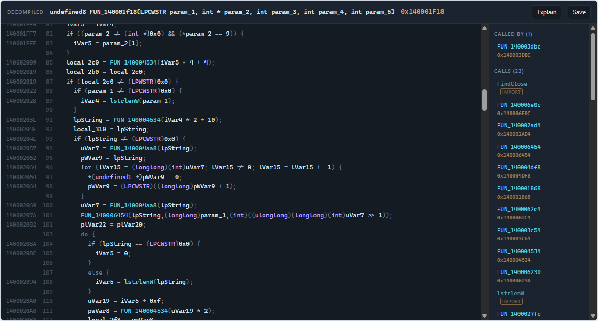
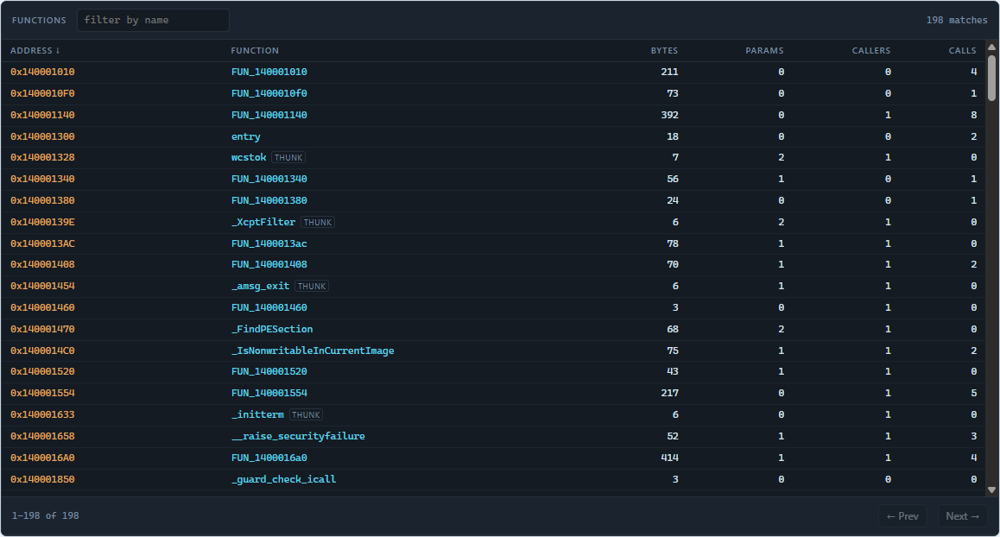
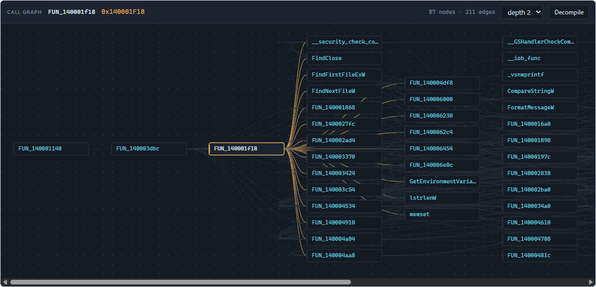

# GhidraLens

**Ghidra, rendered inside your AI client. Click a symbol to rename it. Click a call to follow it.**

[](https://github.com/hellosverre/ghidralens/actions/workflows/ci.yml)
[](https://modelcontextprotocol.io/seps/1865-mcp-apps-interactive-user-interfaces-for-mcp)
[](https://ghidra-sre.org/)
[](#running-it-on-a-local-model)
[](https://www.npmjs.com/package/ghidralens)
[](LICENSE)



Every Ghidra MCP server so far returns text. The model can read it; you cannot
navigate it. GhidraLens returns the same analysis as an **interactive view** —
built on [MCP Apps](https://modelcontextprotocol.io/seps/1865-mcp-apps-interactive-user-interfaces-for-mcp)
(`io.modelcontextprotocol/ui`), the extension that lets a server ship real HTML
into the conversation.

You and the model are looking at the same live program. Rename a variable by
clicking it and the model's next decompile sees the new name.

That is a real screenshot: `where.exe`, decompiled by Ghidra, every identifier
carrying the address it came from.

---

## What you get

| View | What it does |
| --- | --- |
| **Decompiler** | Ghidra's C output as a live token stream — every identifier carries its address and its kind. Click a local to rename it, click a call to follow it. Callers, callees and variables in a sidebar. |
| **Function browser** | Every function in the binary, filterable and sortable by address, name, size or caller count. Click a row to decompile it. |
| **Call graph** | Callers to the left, callees to the right, the function you asked about in the middle. Click any node to recenter. |

### Function browser



### Call graph



Ten tools total. Three open views; the rest are lookups and writes, including
two the model never sees — they exist only so a click in a view can fire them.

## How it fits together

```
  MCP client  ──stdio──▶  server/  ──HTTP──▶  bridge/  ──JPype──▶  Ghidra (JVM)
  (Claude,                 TypeScript         PyGhidra            program stays
   Cursor, …)              MCP server         session             resident
       ▲
       │  ui:// HTML in a sandboxed iframe
       └──  ui/  three self-contained views
```

The bridge is a separate long-lived process on purpose. Ghidra's auto-analysis
is the expensive step, and it happens **once**. Measured on a 64 KB Windows
system utility (198 functions):

| | |
| --- | --- |
| First open, with analysis | **25 s** |
| Re-open the same binary | **0.3 s** |
| Decompile one 2 KB function | **0.4 s** |
| 87-node call graph | **< 0.1 s** |

Restart the MCP server or the client and the analysed program is still there.

## Setup

**Prerequisites:** Ghidra 11.3+, a JDK 21+, Python 3.9–3.13 (**not 3.14** —
JPype has no wheel for it yet), Node 20+. See
[bridge/setup.py.md](bridge/setup.py.md) — the Python side is fussy and that file
covers every way it goes wrong. GhidraLens finds a JDK for you if `JAVA_HOME` is
unset, which covers the usual "installed Java, shell has not restarted" case.

```bash
git clone https://github.com/hellosverre/ghidralens
cd ghidralens
npm install
npm run build
```

Then start the bridge on the binary you want to look at:

```bash
python bridge/serve.py --binary /path/to/target.exe
```

It prints a token. Put that, and the path to the built server, into your MCP
client config:

```json
{
  "mcpServers": {
    "ghidralens": {
      "command": "npx",
      "args": ["-y", "ghidralens"],
      "env": {
        "GHIDRALENS_BRIDGE_URL": "http://127.0.0.1:8799",
        "GHIDRALENS_TOKEN": "paste-the-printed-token-here"
      }
    }
  }
}
```

Running from a clone instead? Point `command` at `node` and `args` at
`/absolute/path/to/ghidralens/server/dist/index.js`.

Then ask your client: *"decompile the function that handles license validation"*.

Also listed in the official MCP Registry as `io.github.hellosverre/ghidralens`.

> **Editing the config by hand?** Quit the client first — properly, including any
> system-tray icon. Claude Desktop keeps its own copy of
> `claude_desktop_config.json` in memory and writes it back over yours when it
> exits, so an edit made while it is running silently disappears on the next
> restart. Editing through Settings → Developer → Edit Config avoids the race
> entirely.

## Tools

| Tool | Visible to | Renders |
| --- | --- | --- |
| `open_binary` | model | — |
| `program_info` | model | — |
| `decompile` | model + view | Decompiler |
| `list_functions` | model + view | Function browser |
| `call_graph` | model + view | Call graph |
| `find_strings` | model | — |
| `xrefs_to` | model + view | — |
| `rename_symbol` | model + view | — |
| `add_comment` | **view only** | — |
| `save_program` | model | — |

`add_comment` is hidden from the model deliberately. Visibility is how MCP Apps
separates "the agent may do this" from "a click may do this"; keeping write
tools out of the model's list keeps it short and stops the model from renaming
things on its own initiative.

Renames and comments live in memory until `save_program` writes them into the
Ghidra project — after which they show up in the Ghidra GUI like any other edit.

## Developing the views without Ghidra

```bash
npm run dev:ui
# open http://localhost:5173/dev/harness.html
```

`ui/dev/harness.ts` is a **real MCP Apps host** — it runs the SDK's `AppBridge`
against the view in an iframe, so the `ui/initialize` handshake, the opening
`ui/notifications/tool-result`, and every `tools/call` a click fires all go over
real postMessage JSON-RPC. There is a message trace down the right-hand side and
a host-theme switch, because the views have to look right in both.

Two data sources, switchable in the toolbar:

- **fixtures** — no Ghidra needed, nothing to install
- **live bridge** — proxies to a running bridge, so you develop against a real
  analysed program

Use live before you trust anything. Fixtures are tidy; real output is a
400-line function with 56 locals and an 87-node call graph, and that is where
layout actually breaks.

## Running it on a local model

Reverse engineering is exactly the work people would rather not send to a hosted
model, so `agent/ollama-agent.mjs` is a small MCP host that puts GhidraLens
behind [Ollama](https://ollama.com) instead. No API key, nothing leaves the
machine.

```bash
OLLAMA_MODEL=qwen3:14b node agent/ollama-agent.mjs "what does this binary do?"
```

It respects `_meta.ui.visibility`, so the app-only tools stay hidden from the
model — the same separation a graphical client enforces. A ~9B model is enough to
orient itself with `find_strings` and `list_functions`; a 14B is noticeably
better at reading decompiled C.

## Tests

| Suite | Needs Ghidra | Covers |
| --- | --- | --- |
| `node server/smoke.mjs` | no | MCP surface: tools, `ui://` resources, tool visibility, graceful failure with no bridge |
| `python bridge/test_serve.py` | no | Bridge auth, CSRF rejection, routing, input validation |
| `python bridge/test_session.py` | **yes** | Every Ghidra call: analysis, caching, decompiler tokens, imports, renames, writes |
| `node server/live.mjs` | **yes** (bridge running) | The whole chain, and that every payload matches the shape the views index into |

The first two are what CI can run. `test_session.py` is the one that matters
after touching `bridge/session.py` — it is the only thing that proves the Ghidra
API calls are right, and it caught three real bugs the day it was written.

## Containerising it

The `Dockerfile` builds the server and views for clients or registries that want
to start it themselves. One thing to get right:

```dockerfile
CMD ["node", "server/dist/index.js"]     # correct
CMD ["npm", "run", "start"]              # breaks the protocol
```

A stdio MCP server speaks JSON-RPC on stdout, and `npm run` / `pnpm run` print
the script banner there first:

```
> ghidralens@0.1.1 start
> node server/dist/index.js
```

Those lines land in the stream ahead of the handshake and the client gives up
mid-initialize. The symptom is unhelpful - the container builds, starts, exits
cleanly, and the client just reports no tools - so it is worth not stepping on.
Invoke node directly.

Real analysis still needs the bridge on the host: `127.0.0.1` inside a container
is the container, so point `GHIDRALENS_BRIDGE_URL` at `host.docker.internal` or
a real address.

## Security

The bridge binds `127.0.0.1` only, requires a per-run token in
`X-GhidraLens-Token`, and rejects any request carrying an `Origin` or `Referer`
header — so a page open in your browser cannot reach your decompiler. It has no
multi-user model and is not meant to be exposed; `--host` refuses anything but
loopback.

Analysing a binary does not execute it, but Ghidra will happily open malware.
Use the same isolation you would use for any other RE work.

## Licence

MIT.
